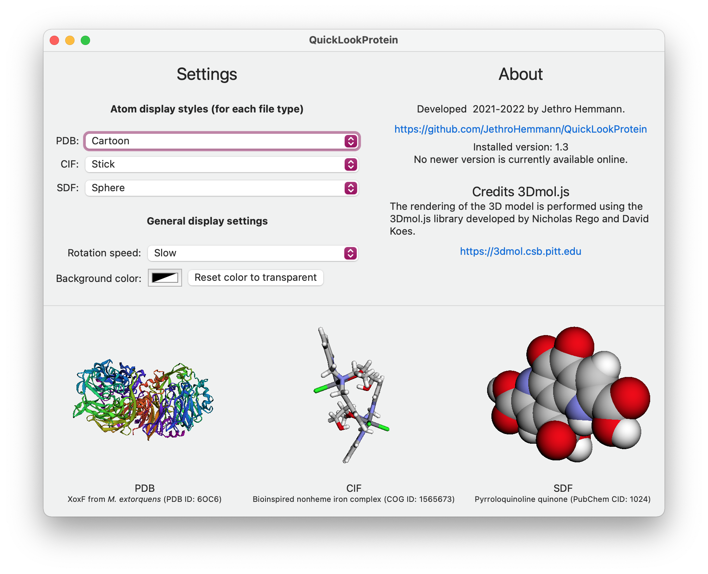
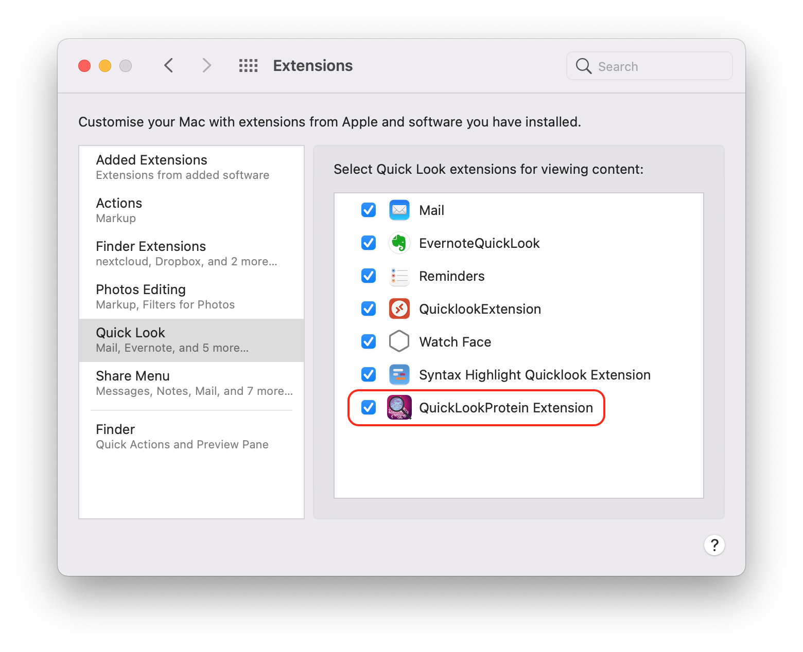

# QuickLookProtein
QuickLookProtein is a macOS Quick Look extension to preview protein/3D structure files (PDB, SDF, CIF). 

It works in all places where macOS uses Quick Look, e.g. in Finder and Spotlight. In Finder, just select the protein structure file and press <kbd>Space</kbd> to open Quick Look.

The rendering of the 3D structure is performed using [3Dmol.js](https://3dmol.csb.pitt.edu). 

The extension is packaged into a main app, whose purpose is to set a few settings used for the display of the 3D models.

I hope this app is useful to you! It is my first Mac OS/Swift app, so I am happy for any feedback! Just open an [issue](https://github.com/JethroHemmann/QuickLookProtein/issues). :-)




## Installation

**Requirements:** QuickLookProtein requires macOS Big Sur (code was built for version 11.0+, but might also require 11.5+, see [#2](https://github.com/JethroHemmann/QuickLookProtein/issues/2)).

**Download:** The current version can be downloaded under [releases](https://github.com/JethroHemmann/QuickLookProtein/releases).

**Installation:** 

1. After downloading the release, unpack the ZIP file. 
2. Move the `QuickLookProtein.app` to the `Applications` folder. 
3. Open `QuickLookProtein.app`. The Quick Look extension should automatically be installed and activated once the main app has been started for the first time. You can check that the extension is activated in `System Preferences` -> `Extensions` -> `Quick Look`. 




## Features

### File types

The following file types are currently supported:

- .PDB
- .CIF
- .SDF

Note that Quick Look extensions depend on the [Uniform Type Identifier (UTI)](https://en.wikipedia.org/wiki/Uniform_Type_Identifier) for the association with a file type, and not simply on the file extension. The UTI of a file may change, depending on the applications you have installed that are associated with the given file type. I tried to register the Quick Look extension with some of the commonly used UTIs for the above file types. But in case the extension is not working on your machine, please let me know the UTI of the file you are trying to preview by running the following command in `Terminal`:

```shell
mdls -name kMDItemContentType filename.ext
```

### Settings

The main app allows the customization of the rendering of the 3D structure. Currently, the following settings can be changed:

- Atom display style for each file type (cartoon, line, stick, sphere)
- Rotation speed (no rotation, slow, medium, fast)
- Background color (any color, or transparent)

Note that the *cartoon* style only works for proteins.

In future releases and depending on user feedback, I might implement additional customizations.

## Implementation details

The code is written using Swift 5 in Xcode 13.

The Quick Look extension displays a Webkit view that uses some simple HTML and the [3Dmol.js](https://3dmol.csb.pitt.edu) library to render the 3D structure.

## Credits

[3Dmol.js](https://3dmol.csb.pitt.edu) is developed by Nicholas Rego and David Koes. See also their publication: [Rego & Koes, 3Dmol.js: molecular visualization with WebGL, *Bioinformatics*, 2015](https://doi.org/10.1093/bioinformatics/btu829)

